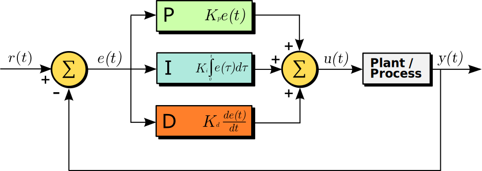

[//]: # (Image References)

[image2]: ./Images/PID_Animated.gif "Animation"


# CarND-Controls-PID
Self-Driving Car Engineer Nanodegree Program

---

## [Rubric](https://review.udacity.com/#!/rubrics/1972/view) Points
### Here I will consider the rubric points individually and describe how I addressed each point in my implementation.  

---
### 1. Objective
The objective of this project is to use PID controllers to control the steering angle and the throttle for driving a car in a game simulator. The simulator provides the cross-track error (CTE), speed and steering angle via websocket. The PID (proportional-integral-differential) controllers give steering and throttle commands back tu the simulator to drive the car reliably around the track.

### Reflection
#### 1. Describe the effect each of the P, I, D components had in your implementation.

the following picture shows the PID algorithm used in this project. 
<center></center>
<center>A block diagram of a PID controller in a feedback loop. r(t) is the desired process value or setpoint (SP), and y(t) is the measured process value (PV).</center>
<center>(by Arturo Urquizo http://commons.wikimedia.org/wiki/File:PID.svg)</center>


A PID controller consist of three steps.
1. Calculate the plant error *e(t)* by substracting the plant measured output *y(t)* from the the system desired setpoint *r(t)*.
`error(t) = r(t) - y(t)`

2. Update the controller gain to minimise the plant error by calculating the three contorller modules, Proportional, Integral and Differential parameters.
 * **Proportional (P)** acts on the present values error and adjust its final contribution based on the *Kp* hyperparameter.
 ` P = Kp * error(t) `

 * **Integral (I)** acts on the summation of all the past and present values error and adjust its final contribution based on the *Ki* parameter. This attempts to minimise drift and model offsets. For example, if the current output has a slight offset, the integral of the error will accumulate over time, and the controller will respond by applying a stronger action towards the setpoint.
 ` I = Ki * sum(error(t) + error(t-1) + error(t-2) + ...)`

 * **Differential (D)** accounts for possible future trends of the error, based on its current rate of change and adjust its final contribution based on the *Kd* parameter. For example, when the controller gain is large, the control output will reduce the rate of change in the gain, effectively dampening the system. The derivative is negative when the error is positive, reducing the size of the *I* and *P* gains and the greater the difference between the current and previous errors, the more the D module reduces the strength of the action to prevent overshooting.
 ` D = Kd * (error(t) - error(t-1)) / delta_t`

3. The sum off all three modules comprises the complete controler gain, and this si then fed to the plant's input.
`output = P + I + D`

The following animation shows the effect of each term on the system.
<center></center>
<center>Effects of varying PID parameters (Kp,Ki,Kd) on the step response of a system.</center>
<center>(https://commons.wikimedia.org/w/index.php?curid=40528698)</center>

#### 2. Describe how the final hyperparameters were chosen.

The hyperparameters for both controllers were tuned manualy following the next steps:

1. Set all gains to zero.
2. Increase the P gain until the response to a disturbance is steady oscillation.
3. Increase the D gain until the the oscillations go away (i.e. it's critically damped).
4. Repeat steps 2 and 3 until increasing the D gain does not stop the oscillations.
5. Set P and D to the last stable values.
6. Increase the I gain until it brings you to the setpoint with the number of oscillations desired

The final hyperparameters used and tested reliable upto a speed of 60Mph are:

PID | Kp | Ki | Kd
---|---|---|---
Steering | -0.1 | -0.001 | -2.1
Speed | 0.5 | 0.00024 | 1.1

A video of the car doing one lap around the track can be found [here](https://youtu.be/jSr763BwnR8)
## Dependencies

* cmake >= 3.5
 * All OSes: [click here for installation instructions](https://cmake.org/install/)
* make >= 4.1(mac, linux), 3.81(Windows)
  * Linux: make is installed by default on most Linux distros
  * Mac: [install Xcode command line tools to get make](https://developer.apple.com/xcode/features/)
  * Windows: [Click here for installation instructions](http://gnuwin32.sourceforge.net/packages/make.htm)
* gcc/g++ >= 5.4
  * Linux: gcc / g++ is installed by default on most Linux distros
  * Mac: same deal as make - [install Xcode command line tools]((https://developer.apple.com/xcode/features/)
  * Windows: recommend using [MinGW](http://www.mingw.org/)
* [uWebSockets](https://github.com/uWebSockets/uWebSockets)
  * Run either `./install-mac.sh` or `./install-ubuntu.sh`.
  * If you install from source, checkout to commit `e94b6e1`, i.e.
    ```
    git clone https://github.com/uWebSockets/uWebSockets 
    cd uWebSockets
    git checkout e94b6e1
    ```
    Some function signatures have changed in v0.14.x. See [this PR](https://github.com/udacity/CarND-MPC-Project/pull/3) for more details.
* Simulator. You can download these from the [project intro page](https://github.com/udacity/self-driving-car-sim/releases) in the classroom.

Fellow students have put together a guide to Windows set-up for the project [here](https://s3-us-west-1.amazonaws.com/udacity-selfdrivingcar/files/Kidnapped_Vehicle_Windows_Setup.pdf) if the environment you have set up for the Sensor Fusion projects does not work for this project. There's also an experimental patch for windows in this [PR](https://github.com/udacity/CarND-PID-Control-Project/pull/3).

## Basic Build Instructions

1. Clone this repo.
2. Make a build directory: `mkdir build && cd build`
3. Compile: `cmake .. && make`
4. Run it: `./pid`. 

Tips for setting up your environment can be found [here](https://classroom.udacity.com/nanodegrees/nd013/parts/40f38239-66b6-46ec-ae68-03afd8a601c8/modules/0949fca6-b379-42af-a919-ee50aa304e6a/lessons/f758c44c-5e40-4e01-93b5-1a82aa4e044f/concepts/23d376c7-0195-4276-bdf0-e02f1f3c665d)

## Editor Settings

We've purposefully kept editor configuration files out of this repo in order to
keep it as simple and environment agnostic as possible. However, we recommend
using the following settings:

* indent using spaces
* set tab width to 2 spaces (keeps the matrices in source code aligned)

## Code Style

Please (do your best to) stick to [Google's C++ style guide](https://google.github.io/styleguide/cppguide.html).

## Project Instructions and Rubric

Note: regardless of the changes you make, your project must be buildable using
cmake and make!

More information is only accessible by people who are already enrolled in Term 2
of CarND. If you are enrolled, see [the project page](https://classroom.udacity.com/nanodegrees/nd013/parts/40f38239-66b6-46ec-ae68-03afd8a601c8/modules/f1820894-8322-4bb3-81aa-b26b3c6dcbaf/lessons/e8235395-22dd-4b87-88e0-d108c5e5bbf4/concepts/6a4d8d42-6a04-4aa6-b284-1697c0fd6562)
for instructions and the project rubric.

## Hints!

* You don't have to follow this directory structure, but if you do, your work
  will span all of the .cpp files here. Keep an eye out for TODOs.

## Call for IDE Profiles Pull Requests

Help your fellow students!

We decided to create Makefiles with cmake to keep this project as platform
agnostic as possible. Similarly, we omitted IDE profiles in order to we ensure
that students don't feel pressured to use one IDE or another.

However! I'd love to help people get up and running with their IDEs of choice.
If you've created a profile for an IDE that you think other students would
appreciate, we'd love to have you add the requisite profile files and
instructions to ide_profiles/. For example if you wanted to add a VS Code
profile, you'd add:

* /ide_profiles/vscode/.vscode
* /ide_profiles/vscode/README.md

The README should explain what the profile does, how to take advantage of it,
and how to install it.

Frankly, I've never been involved in a project with multiple IDE profiles
before. I believe the best way to handle this would be to keep them out of the
repo root to avoid clutter. My expectation is that most profiles will include
instructions to copy files to a new location to get picked up by the IDE, but
that's just a guess.

One last note here: regardless of the IDE used, every submitted project must
still be compilable with cmake and make./

## How to write a README
A well written README file can enhance your project and portfolio.  Develop your abilities to create professional README files by completing [this free course](https://www.udacity.com/course/writing-readmes--ud777).

